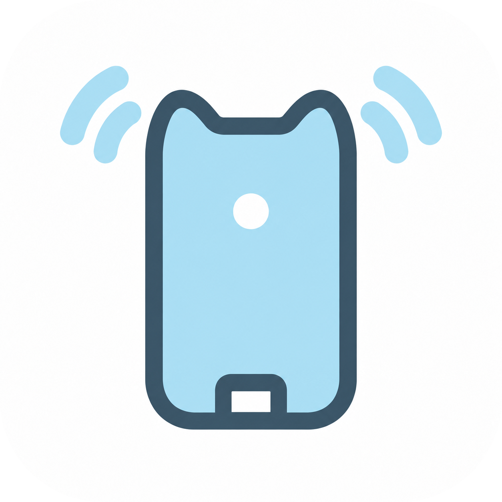
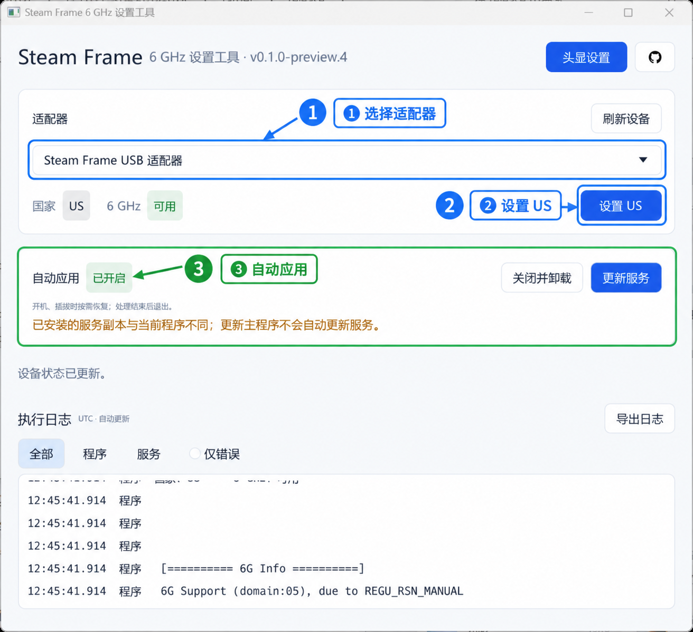
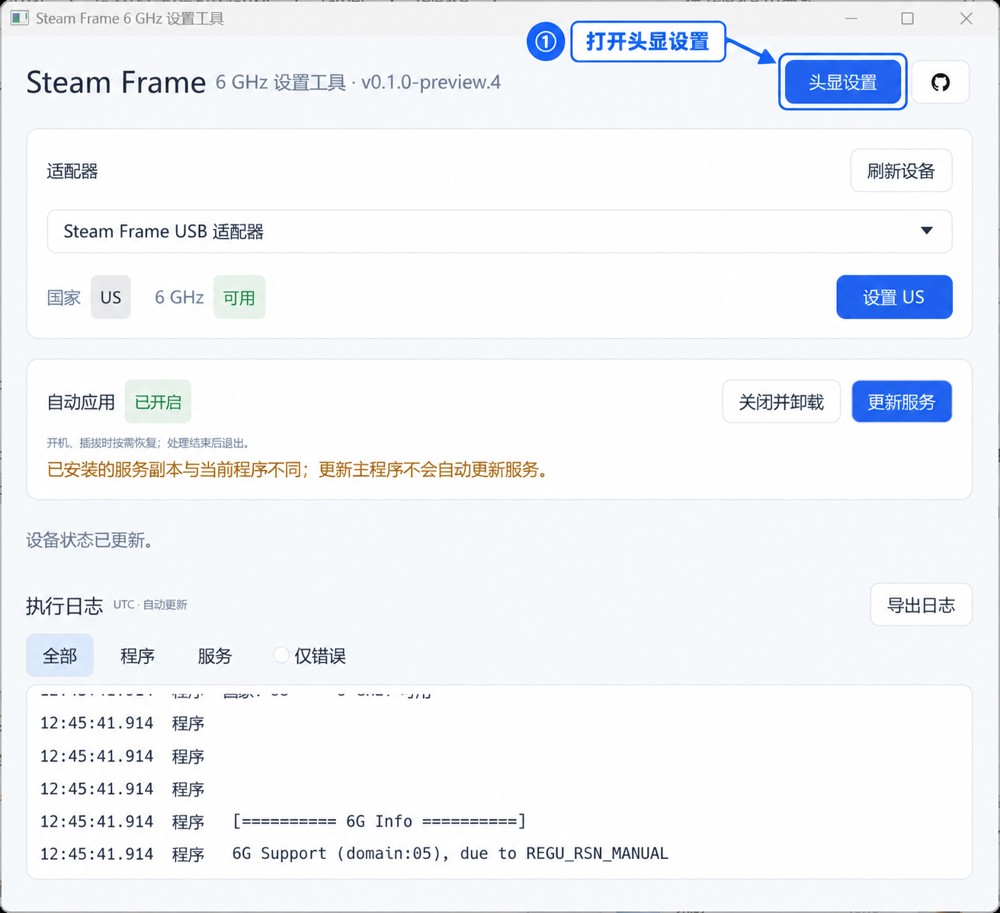
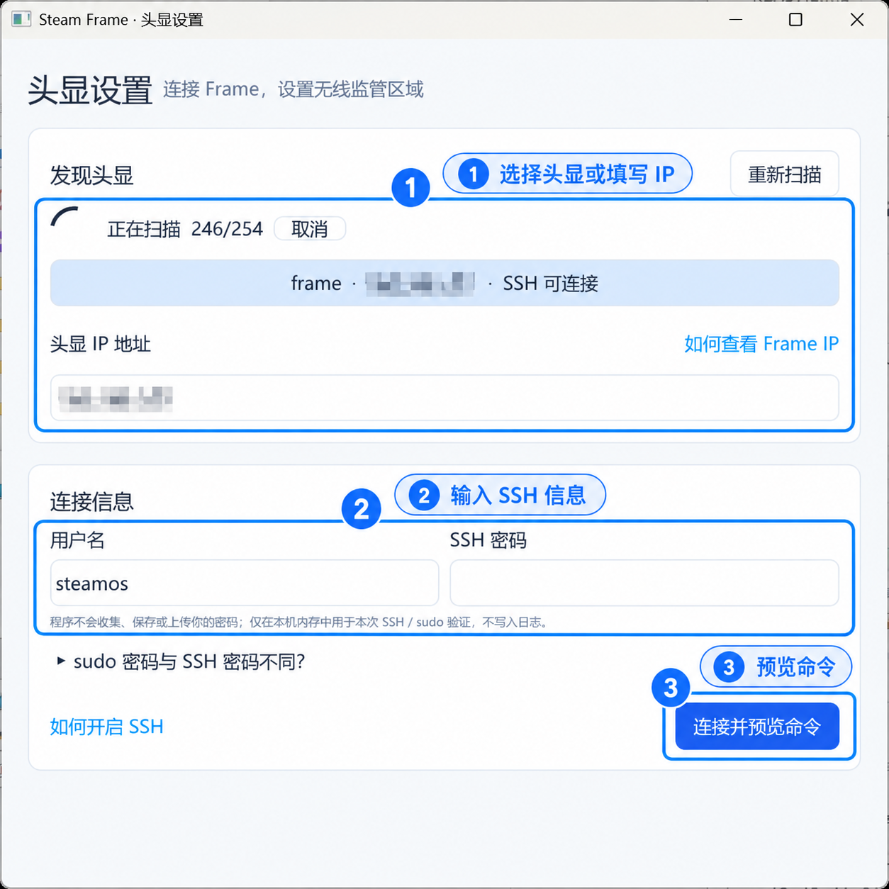
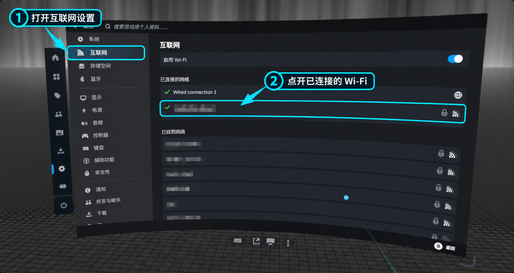
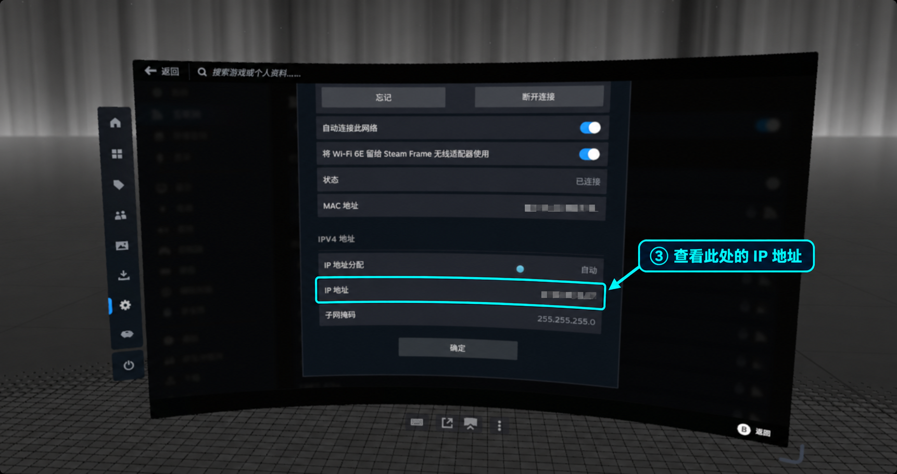
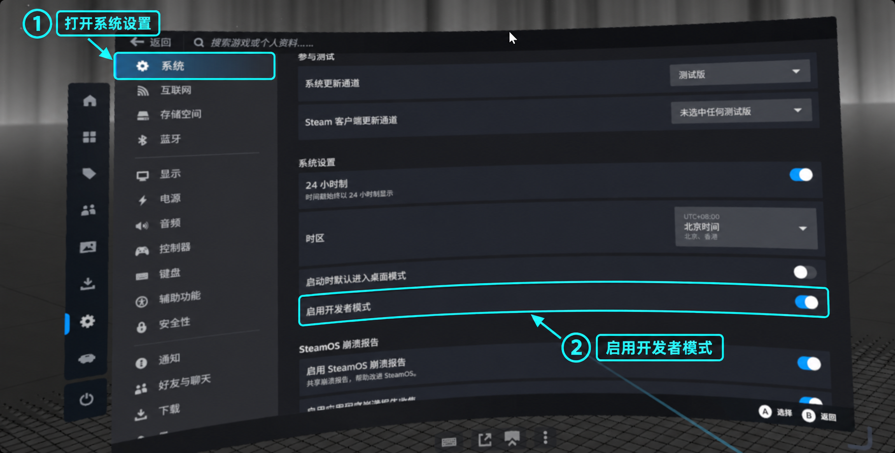
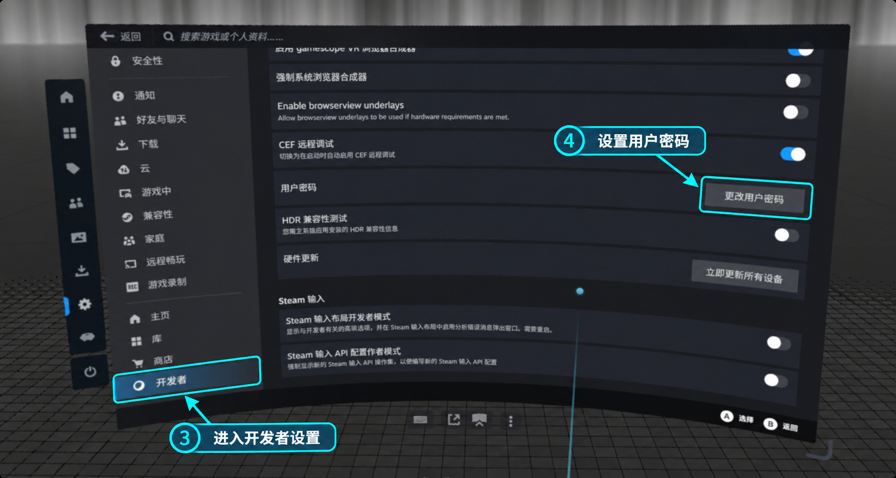

<p align="center"></p>

<h1 align="center">Steam Frame 6 GHz 设置工具</h1>

<p align="center">查看 Steam Frame USB 适配器的国家码和 6 GHz 状态，并将运行地区设置为 US。程序不会修改驱动文件，仅支持 Windows 10/11 x64。</p>

<p align="center"><a href="README.md">简体中文</a> · <a href="README.en.md">English</a></p>

<p align="center">
  <a href="https://github.com/toorux/steam-frame-6ghz-tool/actions/workflows/release.yml"></a>
  
  <a href="https://github.com/toorux/steam-frame-6ghz-tool/releases"></a>
</p>


## 目录

- [开始使用](#开始使用)
- [自动应用](#自动应用)
- [头显设置](#头显设置)
  - [使用程序设置](#使用程序设置)
    - [如何查看 Frame IP](#如何查看-frame-ip)
    - [Frame 如何开启SSH](#frame-如何开启ssh)
  - [手动设置](#手动设置)
- [常见问题](#常见问题)
- [注意](#注意)
- [构建](#构建)
- [发布](#发布)

## 开始使用

从 [Releases](https://github.com/toorux/steam-frame-6ghz-tool/releases) 下载最新程序；下载后建议放到一个单独的文件夹中，程序运行后会在运行目录下创建 `logs` 文件夹。

1. 插入适配器，运行 `steam-frame-6ghz-tool.exe`，按提示允许管理员权限。
2. 只有一个匹配设备时自动选中并查询状态；多个设备时，选择后自动查询。
3. 如需更改适配器地区，点击“设置 US”，确认后执行一次并自动复查。



图示为已设置 US、已开启自动应用的状态；黄色提示表示服务副本待更新，首次运行不一定出现。

> [!TIP]
> 如果 Windows 适配器已显示 `US`，头显仍无法连接，参见[头显设置](#头显设置)。

## 自动应用

> 由于电脑重启或适配器重新插拔后设置可能失效，需要再次操作。若不想每次手动设置，可以开启“自动应用”。

运行程序并允许管理员权限，点击“开启自动应用”并确认。开启后，系统会在开机或适配器重新插入时自动检查，并按需设置为 US；处理完成后自动退出，不会常驻后台。上图 ③ 所示为已开启状态。

- 自动日志保存在程序旁的 `logs` 目录，程序移动后需重新开启自动服务。
- 日志最多保留 20 份，不包含 Wi-Fi 密码。
- 结果不确定或操作中断时会暂停；明确失败会记录日志，不会立即重试。
- 卸载服务不会删除日志，也不会恢复当前 US 状态。
- 程序更新后，如服务副本与当前程序不同，“更新服务”按钮会高亮；确认后可一键重装，日志保留。服务正在执行或已暂停时不会自动重装。
- 未验证驱动版本会尝试执行，但不保证有效。

## 头显设置

如果 Windows 适配器已显示 `US`、`6 GHz 可用`，但 Frame 仍无法连接，可以进一步检查头显的无线监管区域。

下方提供程序设置和手动设置两种方式；不熟悉命令行，建议选择程序设置。

### 使用程序设置

先在 Frame [开启 SSH](#frame-如何开启ssh)并设置密码，确保电脑与头显在同一局域网。然后点击主窗口右上角的“头显设置”（下图 ①）。



1. 在子窗口选择扫描到的 `frame`；若未扫描到，可手动填写头显 IP。查看方法见[如何查看 Frame IP](#如何查看-frame-ip)。
2. 用户名默认为 `steamos`；填写 SSH 密码。如 sudo 密码不同，展开对应选项另行填写，然后点击“连接并预览命令”。下图中的 IP 已遮盖，实际使用时请填写自己的头显地址。



3. 核对连接目标、SSH 主机密钥指纹和将执行的命令；首次连接还需确认信任指纹。确认执行后，程序会设置运行时 `US`、按需启用永久配置并复查。若永久配置已是 `US`，不会重复修改文件。程序不会自动重启头显；完成后请自行重启，并用 `iw reg get` 确认全局区域与 `phy#0` 均为 `US`。

程序不会收集、保存或上传密码；密码仅在本机内存中用于本次 SSH／sudo 验证，不写入日志。

#### 如何查看 Frame IP

在头显中打开“设置 → 互联网”，查看与电脑网络互通的已连接网络。下图以 Wi-Fi 为例；使用有线连接时也可查看其 IP。



在网络详情的“IPv4 地址”区域，找到“IP 地址”一行，把该地址填入程序的“头显 IP 地址”输入框；不要填 MAC 地址或子网掩码。图片中的网络名称、MAC 和实际 IP 均已遮盖。



#### Frame 如何开启SSH

1. 在 Frame 中打开“设置 → 系统”，开启“启用开发者模式”（图中 ①②）。



2. 打开设置侧栏底部出现的“开发者”页面，找到“用户密码”，点击“设置用户密码”或“更改用户密码”并完成设置（图中 ③④）。截图中的按钮显示“更改用户密码”，因为该设备已经设置过密码。



3. 确保电脑和头显在同一局域网，然后从电脑尝试连接：

```sh
ssh steamos@frame
```

若主机名 `frame` 无法解析，按[如何查看 Frame IP](#如何查看-frame-ip)找到头显地址，再执行 `ssh steamos@<头显IP>`。登录密码就是上一步设置的用户密码。

### 手动设置

> [!IMPORTANT]
> 不熟悉命令行时，建议使用上面的[程序自动设置](#使用程序设置)。如果已通过程序完成了设置，可以跳过本节。

通过 SSH 连接到 Frame，或直接在 Frame 中打开终端。先查看当前区域及配置：

```sh
iw reg get
grep -nE '^(#)?WIRELESS_REGDOM=' /etc/conf.d/wireless-regdom
```

若区域不是 `US`，先设置本次运行时区域：

```sh
sudo iw reg set US
```

如果配置中存在且仅存在一条 `#WIRELESS_REGDOM="US"`，可取消注释以便重启后继续使用：

```sh
sudo sed -i 's/^#WIRELESS_REGDOM="US"$/WIRELESS_REGDOM="US"/' /etc/conf.d/wireless-regdom
grep '^WIRELESS_REGDOM=' /etc/conf.d/wireless-regdom
```

若原本已是 `WIRELESS_REGDOM="US"`，不用再次修改。确认 `grep` **只输出一条**有效配置：

```text
WIRELESS_REGDOM="US"
```

若文件内容不是上述两种情况，先不要运行 `sed`；程序自动设置也会在预检异常时停止。确认配置后，自行重启头显：

```sh
sudo reboot
```

重启完成后，再执行：

```sh
iw reg get
```

确认全局区域和 `phy#0` 均显示为 `US`，随后重新进行配对。

如果原本是注释行、且这次按教程启用了它，如需恢复原配置，执行：

```sh
sudo sed -i 's/^WIRELESS_REGDOM="US"$/#WIRELESS_REGDOM="US"/' /etc/conf.d/wireless-regdom
sudo reboot
```

## 常见问题

- 未找到适配器：检查连接和驱动，再点击“刷新设备”。
- 提示权限不足：确认启动时已允许管理员权限。
- 未找到头显：确认电脑与头显在同一局域网且 SSH 已开启，或手动输入头显 IP。

## 注意

- 当前程序仅在有限环境下测试，尚未经过广泛验证，不保证在所有设备、系统及驱动版本上正常工作。
- 支持 Windows 10/11 x64。已验证原厂驱动 `5.32.908.2026`；其他版本仅提示未验证，不限制操作。
- 设置仅影响运行时状态，不会永久写入适配器；未开启自动应用时，重启或重新插拔后可能需要再次设置。
- 使用时关闭其他适配器诊断工具。操作失败或结果不确定时，先查看日志，稍后刷新查询。
- 语言切换只影响界面；驱动和服务日志保留原文。
- 仅用于授权的屏蔽实验环境。设置 US 会改变无线运行策略，请遵守所在地无线电规定。

## 构建

安装 Rust MSVC 工具链、Visual Studio C++ Build Tools 和 Windows SDK 后执行：

```powershell
cargo test --locked
cargo build --release --locked
```

生成文件：`target/release/steam-frame-6ghz-tool.exe`。

## 发布

推送与 `Cargo.toml` 版本一致的标签后，GitHub Actions 会自动测试、构建并发布 Release，附带 Windows x64 程序和 SHA256 校验文件。

将以下命令中的 `X.Y.Z` 换成 `Cargo.toml` 中的当前版本（包括预览版后缀）：

```powershell
git tag vX.Y.Z
git push origin vX.Y.Z
```

也可在 Actions → Build and release → Run workflow 中选择 `main`，填写已有标签手动发布。构建使用该标签的代码。
